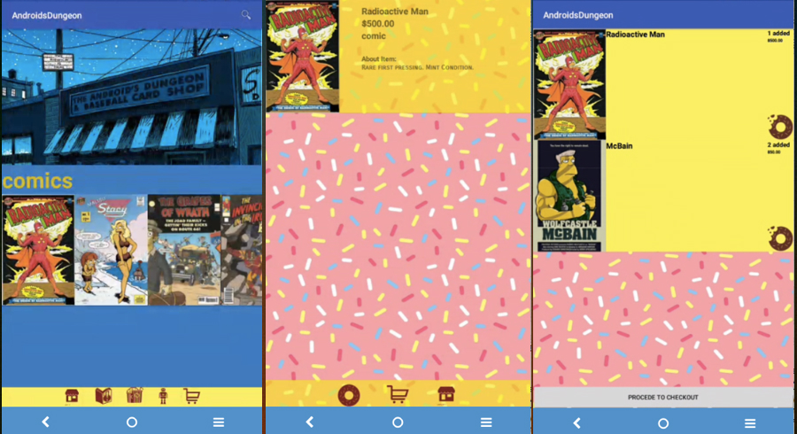

# The Android's Dungeon & Baseball Card Shop App
<h2>An app for the fictional comic book shop from The Simpsons</h2>
<h3>This app is a mobile commerce app that displays items in a store in its Main Activity.
There are three type of items you could purchase.</h3>

<h3>
All items are stored in a database via SQLite. You can press a button to display only the type of item you want (Comics, Movies, Collectables). 
Alternatively, you can type in the title in the search bar. Clicking on an item will take you to a Detail Activity. 
Pressing the donut icon can add the item to your cart. You can purchase all your items, or delete items from cart
using the half-eaten donut icon.
</h3>

